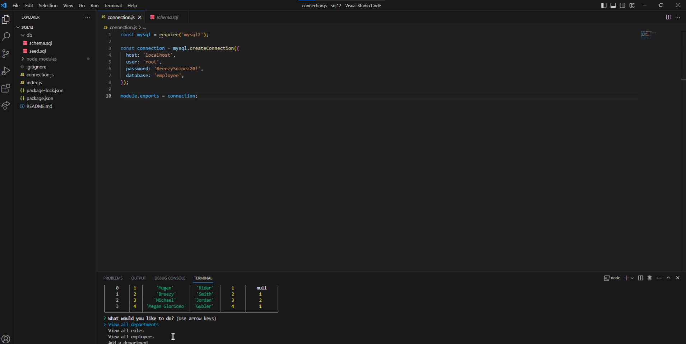

# SQL12 - Employee Management System

## Description

SQL12 is a command-line application designed to help business owners easily view and manage departments, roles, and employees within their company. This tool provides an efficient way to organize and plan business operations.

## User Story

AS A business owner
I WANT to be able to view and manage the departments, roles, and employees in my company
SO THAT I can organize and plan my business

## Acceptance Criteria

- **GIVEN** a command-line application that accepts user input
- **WHEN** I start the application
- **THEN** I am presented with the following options: view all departments, view all roles, view all employees, add a department, add a role, add an employee, and update an employee role
- **WHEN** I choose to view all departments
- **THEN** I am presented with a formatted table showing department names and department IDs
- **WHEN** I choose to view all roles
- **THEN** I am presented with a table displaying job titles, role IDs, the corresponding departments, and the salaries for each role
- **WHEN** I choose to view all employees
- **THEN** I am presented with a formatted table displaying employee data, including IDs, first names, last names, job titles, departments, salaries, and manager information
- **WHEN** I choose to add a department
- **THEN** I am prompted to enter the name of the department, and it is added to the database
- **WHEN** I choose to add a role
- **THEN** I am prompted to enter the name, salary, and department for the role, and it is added to the database
- **WHEN** I choose to add an employee
- **THEN** I am prompted to enter the employee's first name, last name, role, and manager, and the employee is added to the database
- **WHEN** I choose to update an employee role
- **THEN** I am prompted to select an employee to update and their new role, and this information is updated in the database

## Installation

To run this application, you need the following dependencies:

- Inquirer package
- MySQL2 package to connect to a MySQL database

## Screenshots

## Getting Started

1. Clone the repository.
2. Install the required dependencies using:
   
   npm install
   
3. Set up your MySQL database and connection in the appropriate files.
4. Run the application:
   
   npm start
   
5. Follow the prompts to manage departments, roles, and employees in your company.

## License

This project is licensed under the MIT License.

## GitHub Repository

Find the code and more details in the [https://github.com/mugenrider1994/sql12]

